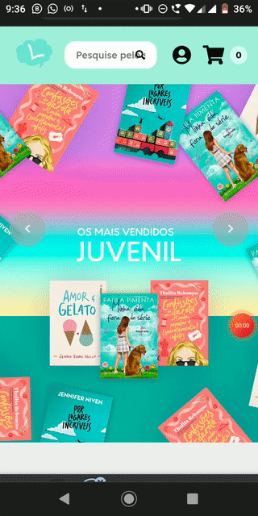

<p align="center">
  
</p>

# Livraria Liberta

A Liberta é um lugar para vender ideias e conhecimento através dos livros. Libertar-se em busca de conhecer, descobrir e pensar. Esse é o projeto final do módulo 5 da @resilia-br.

<p align="center">
  
  
</p>


## Livraria Liberta (back-end)

Você pode acessar o back-end do projeto do módulo 5 [aqui](https://github.com/willy-r/livraria-liberta-api) desenvolvido por todos, organizado pelo [William Rodrigues](https://github.com/willy-r).


## Informações gerais

Para rodar esse projeto é necessário ter a versão **14+** do *NodeJS*.

### Tecnologias utilizadas

Essas são algumas das bibliotecas e frameworks utilizadas no projeto.

- [NodeJS](https://nodejs.org/en/)
- [ReactJS](https://reactjs.org/)
- [styled-components](https://www.npmjs.com/package/styled-components)
- [axios](https://www.npmjs.com/package/axios)
- [node-sass](https://www.npmjs.com/package/node-sass)

### UI/UX e Design do Projeto
A parte UI/UX deste projeto foi realizada por [Gabriela Costa](https://github.com/gabrielaalvescosta) e você pode conferir o projeto (realizado em Adobe Photoshop CC e passado posteriormente para o Figma) [clicando neste link](https://www.figma.com/file/K2xd8ApFTccZpZau0pXr5B/PROJETO-FINAL-RESILIA-M%C3%93DULO-5).

## Rodar localmente

No terminal de sua escolha, clone o repositório:

```bash
git clone https://github.com/willy-r/livraria-liberta.git
```

Vá até o diretório do projeto:

```bash
cd livraria-liberta
```

Instale as dependências:

```bash
npm install
```

Inicie o servidor local:

```bash
npm start
```


## Estado do projeto

**Em desenvolvimento...** 🚧

### Para fazer

- [x] Página de recuperação de senha
- [ ] Página para checkout do pagamento


## Grupo 10 & Autores

- [Gabriela Costa](https://github.com/gabrielaalvescosta)
- [William Rodrigues](https://github.com/willy-r)
- [Ana Karolina](https://github.com/kasvrol)
