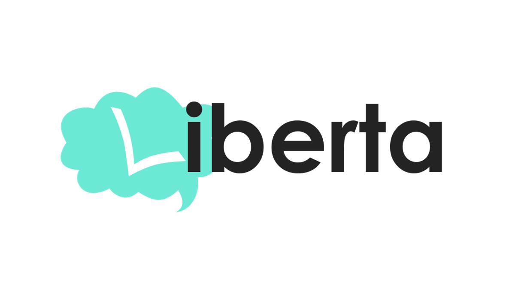

  

# Livraria Liberta

A Liberta é um lugar para vender ideias e conhecimento através dos livros. Libertar-se em busca de conhecer, descobrir e pensar. Projeto final do módulo 5 da @resilia-br realizado em ReactJS e Sass.

## Livraria Liberta (back-end)

Você pode acessar o back-end do projeto do módulo 5 [aqui](https://github.com/willy-r/livraria-liberta-api) desenvolvido por todos, organizado pelo [William Rodrigues](https://github.com/willy-r).

## Estado do projeto

**Em construção...**

### Para fazer

- Página de recuperação de senha
- Página para checkout do pagamento

## Group 10 & Autores

- [William Rodrigues](https://github.com/willy-r)
- [Gabriela Costa](https://github.com/gabrielaalvescosta)
- [Ana Karolina](https://github.com/kasvrol)
